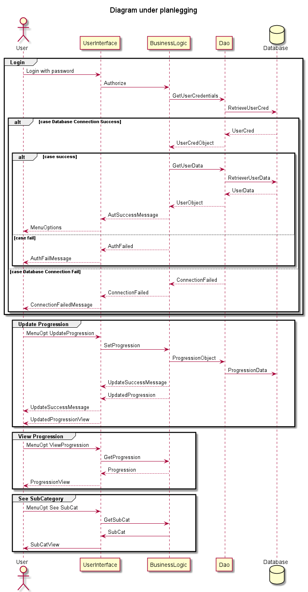
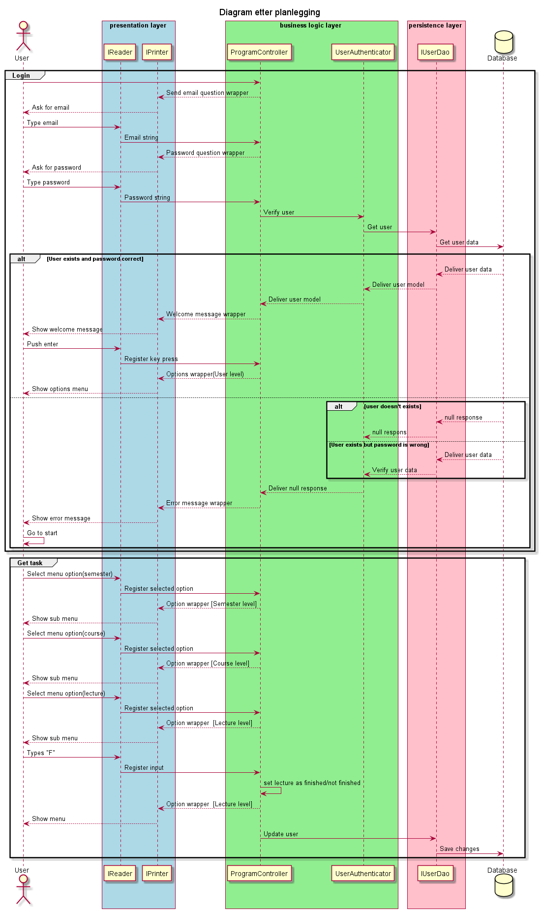
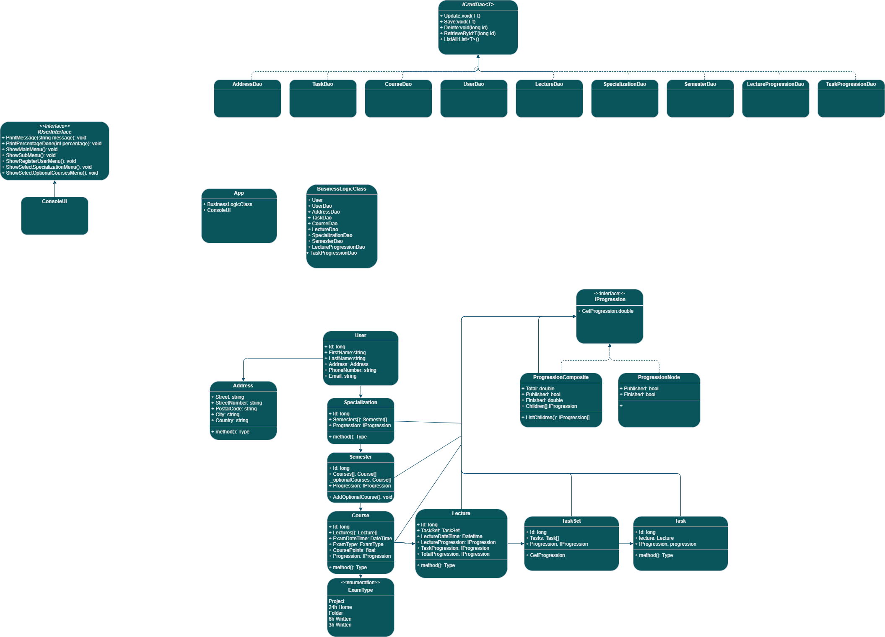
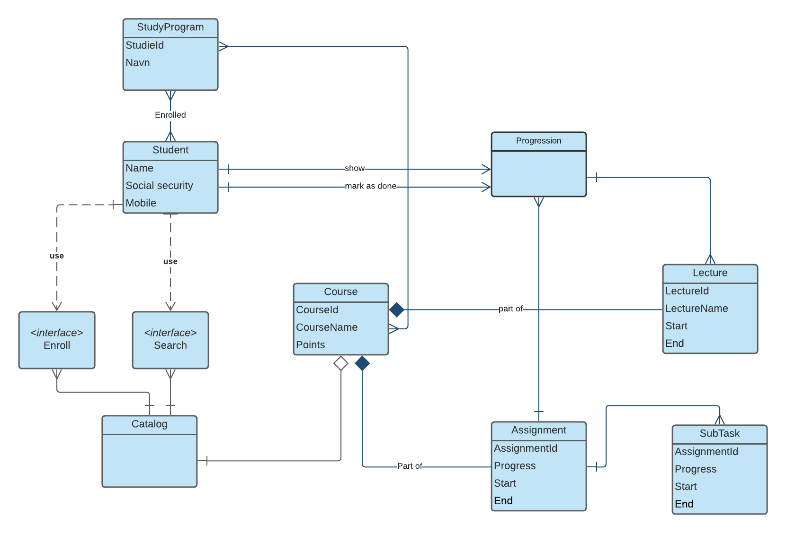
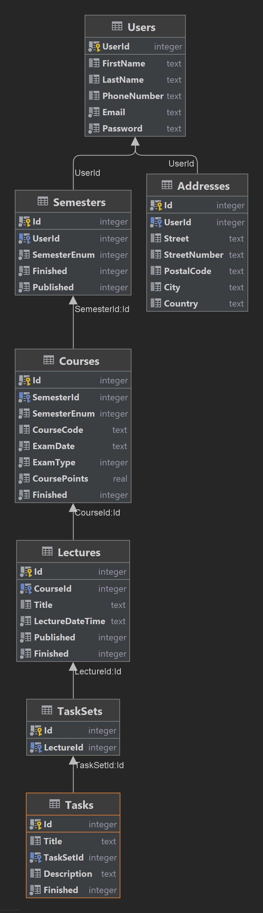

# PG332_SoftwareDesign_EksamenH21

## Eksamensoppgave i Software Design, H2021

### Gruppemedlemmer
* Christian Gregersen
* Christoffer Østborg
* Harry Liam
* Roman Morso
* Marie Stigen

## Oppgave

### Brukerveiledning

#### For å migrere EFCore må disse kommandoene kjøres fra terminalen
`dotnet tool install --global dotnet-ef`\
`dotnet ef database update`
- Hvordan kjøre programmet
  * Start programmet i visual studio eller standalone
  * Logg inn med brukeren `kim@bruun.no`
  * Benytt passordet `daarligpassord`

#### NB:
Filene `tracker.db` og `progression-tracker-log.txt` blir lagret i `C:/Users/<BRUKER>/AppData/Local/` (Windows)

### Oppgavebeskrivelse

- Hva oppgaven er og kort hvordan vi løste den

### Diagram

#### Før vi begynte å kode:

#### Etter alt var kodet ferdig:

#### Klassediagram planlegging

#### Etter alt var kodet ferdig:
[UML-diagrams.pdf](https://github.com/chgr007/PG332_SoftwareDesign_EksamenH21/files/7566074/UML-diagrams.pdf)
#### Domene-modelldiagram planlegging

#### Generert ER-Diagram fra Rider IDE

